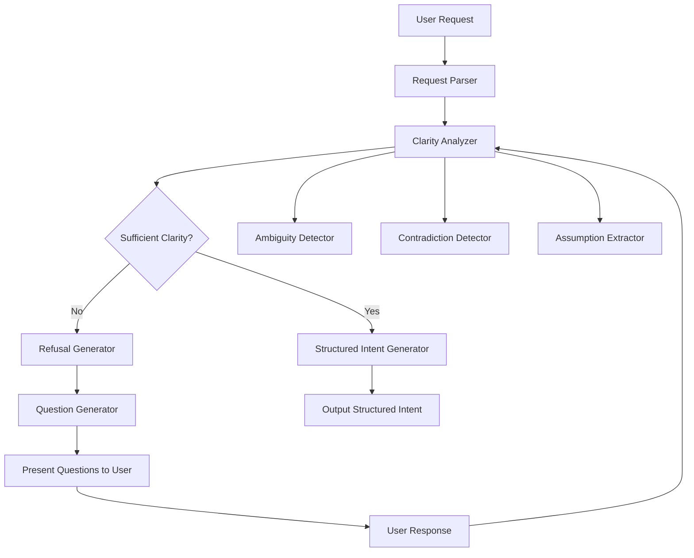

# Design Document: ClarifyAI

## Overview

ClarifyAI is an AI-powered clarity enforcement system that prevents developers from building solutions to poorly-specified problems. The system operates through a refusal-and-questioning loop: it analyzes incoming requests for ambiguity, strategically refuses to proceed when clarity is insufficient, asks targeted questions to expose assumptions and force decisions, and only produces structured intent once an unambiguous problem statement has been achieved.

The core innovation is the strategic refusal mechanism combined with intelligent question generation. Unlike traditional AI assistants that attempt to generate something from any input, ClarifyAI treats ambiguity as a blocker and uses conversation to progressively refine understanding until the problem space is well-defined. ClarifyAI does not generate code or implementations — it produces build-ready intent specifications that downstream systems can safely act upon.

**Differentiation from Prior Research:** Most existing clarification systems focus on improving prompt quality for better model output. ClarifyAI focuses on clarifying human intent to prevent misaligned systems. The goal is not to make AI perform better, but to stop humans from building the wrong thing.

For the hackathon demo, the system will showcase the "fair user ranking system" scenario, demonstrating how a seemingly simple request contains multiple hidden assumptions, undefined terms, and conflicting goals that must be resolved before any meaningful implementation can begin.

## Architecture

ClarifyAI follows a pipeline architecture with three main stages:

1. **Analysis Stage**: Incoming requests are parsed and analyzed for clarity issues
2. **Clarification Stage**: Questions are generated and user responses are processed iteratively
3. **Output Stage**: Either structured intent is produced (if clear) or refusal with questions (if unclear)

**Operational Modes:**
- **Challenge Mode (default)**: Actively refuses vague requests, highlights ambiguity, surfaces contradictions, asks uncomfortable questions. This is ClarifyAI's primary mode.
- **Build Mode (optional, user-enabled)**: Assumes clarified intent, reduces refusal frequency, focuses on structuring rather than challenging. Still flags major contradictions but more softly. Build Mode does not bypass clarity enforcement; it only reduces refusal frequency once core intent has been established. Users must explicitly opt into this mode.



The system maintains conversation state across the clarification loop, tracking:
- Original request and all user responses
- Identified ambiguities and their resolution status
- Extracted assumptions and constraints
- Detected contradictions and how they were resolved

## Components and Interfaces

### Request Parser

**Purpose**: Tokenize and parse user requests into structured representations for analysis.

**Interface**:
```typescript
interface RequestParser {
  parse(request: string): ParsedRequest;
}

interface ParsedRequest {
  rawText: string;
  tokens: Token[];
  entities: Entity[];
  intent: string;
}

interface Token {
  text: string;
  type: 'term' | 'constraint' | 'goal' | 'modifier';
  position: number;
}

interface Entity {
  name: string;
  type: 'technical_term' | 'domain_concept' | 'metric';
  definition?: string;
}
```

**Behavior**: Uses natural language processing to identify key terms, goals, constraints, and domain concepts. Extracts entities that may need definition.

### Clarity Analyzer

**Purpose**: Analyze parsed requests for ambiguity, contradictions, and missing information.

**Interface**:
```typescript
interface ClarityAnalyzer {
  analyze(request: ParsedRequest, context: ConversationContext): ClarityReport;
}

interface ClarityReport {
  clarityScore: number; // 0-100, where 100 is perfectly clear
  ambiguities: Ambiguity[];
  contradictions: Contradiction[];
  missingConstraints: MissingConstraint[];
  hiddenAssumptions: Assumption[];
  isSufficientlyClear: boolean;
}

interface Ambiguity {
  type: 'undefined_term' | 'multiple_interpretations' | 'vague_constraint';
  description: string;
  affectedEntities: string[];
}

interface Contradiction {
  goals: string[];
  description: string;
  tradeoffRequired: boolean;
}

interface MissingConstraint {
  category: 'performance' | 'scale' | 'boundary' | 'quality';
  description: string;
  importance: 'critical' | 'important' | 'nice_to_have';
}

interface Assumption {
  description: string;
  impact: string;
  needsValidation: boolean;
}
```

**Behavior**: 
- Scans for undefined technical terms and domain concepts
- Identifies goals that may conflict (e.g., "engagement" vs "quality")
- Detects missing critical constraints (boundaries, scale, quality requirements)
- Extracts implicit assumptions from request phrasing
- Calculates clarity score based on number and severity of issues

### Refusal Generator

**Purpose**: Generate clear, informative refusal messages that explain why the request cannot be fulfilled.

**Interface**:
```typescript
interface RefusalGenerator {
  generateRefusal(report: ClarityReport): RefusalMessage;
}

interface RefusalMessage {
  message: string;
  reasons: RefusalReason[];
  severity: 'blocking' | 'warning';
}

interface RefusalReason {
  category: string;
  description: string;
  examples?: string[];
}
```

**Behavior**: Creates human-readable explanations of clarity issues. Prioritizes the most critical issues and provides context for why they matter.

### Question Generator

**Purpose**: Generate targeted clarifying questions that expose assumptions and force decisions.

**Interface**:
```typescript
interface QuestionGenerator {
  generateQuestions(report: ClarityReport, context: ConversationContext): Question[];
}

interface Question {
  id: string;
  text: string;
  type: 'definition' | 'constraint' | 'tradeoff' | 'assumption';
  priority: number;
  relatedAmbiguity?: string;
}
```

**Behavior**: 
- Generates questions for undefined terms (definition questions)
- Generates questions for missing constraints (constraint questions)
- Generates questions that force tradeoff decisions (tradeoff questions)
- Generates questions that surface assumptions (assumption questions)
- Limits to 5 questions per iteration, prioritized by importance
- Avoids redundant questions by checking conversation history

### Interpretation Generator

**Purpose**: Generate multiple valid interpretations when ambiguity exists.

**Interface**:
```typescript
interface InterpretationGenerator {
  generateInterpretations(request: ParsedRequest, report: ClarityReport): Interpretation[];
}

interface Interpretation {
  id: string;
  title: string;
  description: string;
  keyAssumptions: string[];
  implications: string[];
  differentiators: string[];
}
```

**Behavior**: When a request has multiple valid interpretations, generates 2-4 distinct interpretations showing how different assumptions lead to different solutions.

### Structured Intent Generator

**Purpose**: Produce the final, unambiguous problem statement after sufficient clarity is achieved. This is ClarifyAI's primary output — not code generation.

**Interface**:
```typescript
interface StructuredIntentGenerator {
  generate(request: ParsedRequest, context: ConversationContext): StructuredIntent;
}

interface StructuredIntent {
  title: string;
  goals: Goal[];
  constraints: Constraint[];
  assumptions: string[];
  resolvedTradeoffs: Tradeoff[];
  scope: Scope;
}

interface Goal {
  description: string;
  measurableOutcome: string;
  priority: 'primary' | 'secondary';
}

interface Constraint {
  category: string;
  description: string;
  value?: string;
}

interface Tradeoff {
  options: string[];
  chosenOption: string;
  rationale: string;
}

interface Scope {
  inScope: string[];
  outOfScope: string[];
  boundaries: string[];
}
```

**Behavior**: Synthesizes all information gathered during clarification into a structured document with clearly defined goals, explicit constraints, surfaced assumptions, and resolved tradeoffs. This document signals that generation may now safely occur in downstream systems, but ClarifyAI itself does not perform that generation.

### Conversation Manager

**Purpose**: Manage conversation state and history across the clarification loop.

**Interface**:
```typescript
interface ConversationManager {
  startConversation(initialRequest: string): ConversationContext;
  addUserResponse(context: ConversationContext, response: string): ConversationContext;
  getHistory(context: ConversationContext): ConversationTurn[];
}

interface ConversationContext {
  id: string;
  initialRequest: string;
  turns: ConversationTurn[];
  resolvedAmbiguities: string[];
  unresolvedAmbiguities: string[];
  currentClarityScore: number;
}

interface ConversationTurn {
  speaker: 'user' | 'clarifyai';
  message: string;
  timestamp: number;
  type: 'request' | 'refusal' | 'question' | 'response' | 'intent';
}
```

**Behavior**: Tracks conversation history, maintains state of resolved and unresolved issues, prevents redundant questions.

## Data Models

### UI Design Philosophy

The interface should embody ClarifyAI's core philosophy: challenging by default, calm by design, configurable by intent.

**Visual Principles:**
- **Flamboyance that visualizes thinking, not decoration**: Use animation and visual design to make ambiguity visible, contradictions obvious, and clarity felt
- **Figma-level polish, Linear-level restraint, Notion-level clarity**: High-quality design without unnecessary motion or gimmicks
- **Distinct visual states**: Vague input, refusal, clarification, and structured intent should each have clear visual identities
- **Refusal is not an error**: Refusal should feel deliberate and intentional, not like a failure state

**Interaction Patterns:**
- Ambiguous terms highlighted inline
- Visual conflict markers between contradictory goals
- Side-by-side interpretation cards
- Clarity "snap-into-place" moments when threshold is reached
- Structured intent feels like a document, not a message

**What to Avoid:**
- Gradients everywhere
- Unnecessary motion
- Gimmicky effects
- Playful or apologetic copy
- ChatGPT-style conversation bubbles

The UI should make someone think: "Someone thought very hard about this."

### Core Data Structures

**Request Representation**:
```typescript
type Request = {
  id: string;
  rawText: string;
  parsed: ParsedRequest;
  submittedAt: number;
};
```

**Clarity State**:
```typescript
type ClarityState = {
  score: number;
  status: 'insufficient' | 'partial' | 'sufficient';
  blockers: ClarityIssue[];
  warnings: ClarityIssue[];
};

type ClarityIssue = {
  type: 'ambiguity' | 'contradiction' | 'missing_constraint' | 'assumption';
  severity: 'critical' | 'important' | 'minor';
  description: string;
  resolved: boolean;
};
```

**Demo Scenario Data**:
For the hackathon demo, we'll pre-configure the "fair user ranking system" scenario with expected ambiguities and questions. The demo scenario is pre-configured for reliability, but the same clarification logic applies to arbitrary requests.

```typescript
type DemoScenario = {
  name: string;
  triggerPhrase: string;
  expectedAmbiguities: string[];
  clarifyingQuestions: string[];
  interpretations: Interpretation[];
};

const FAIR_RANKING_SCENARIO: DemoScenario = {
  name: "Fair User Ranking System",
  triggerPhrase: "fair user ranking",
  expectedAmbiguities: [
    "undefined: 'fair'",
    "undefined: target audience",
    "missing: gaming prevention",
    "missing: ranking criteria",
    "potential contradiction: engagement vs quality"
  ],
  clarifyingQuestions: [
    "Who is this ranking for? (users viewing rankings, or users being ranked?)",
    "What does 'fair' mean in this context? (equal opportunity, merit-based, transparent?)",
    "What happens if users game the system?",
    "What metrics determine rank? (engagement, quality, recency?)",
    "How do you balance engagement with content quality?"
  ],
  interpretations: [
    {
      id: "engagement-focused",
      title: "Engagement-Focused Ranking",
      keyAssumptions: ["Fair = most engaging content rises", "Gaming is acceptable"],
      implications: ["Viral content dominates", "Quality may suffer"]
    },
    {
      id: "quality-focused",
      title: "Quality-Focused Ranking",
      keyAssumptions: ["Fair = highest quality content rises", "Expert review required"],
      implications: ["Slower ranking changes", "Less viral spread"]
    },
    {
      id: "balanced",
      title: "Balanced Ranking",
      keyAssumptions: ["Fair = weighted combination", "Multiple signals needed"],
      implications: ["Complex algorithm", "Tuning required"]
    }
  ]
};
```


## Correctness Properties

*A property is a characteristic or behavior that should hold true across all valid executions of a system—essentially, a formal statement about what the system should do. Properties serve as the bridge between human-readable specifications and machine-verifiable correctness guarantees.*

### Property Reflection

After analyzing all acceptance criteria, several properties can be consolidated:
- Properties about "refusal when X is missing" (2.1, 2.2, 2.3) can be combined into a single property about refusal conditions
- Properties about "question generation for X" (3.1, 3.2, 3.3, 3.4) share the same pattern and can be verified together
- Properties about "structured intent contains X" (5.2, 5.3, 5.4, 5.5) can be combined into completeness properties
- Detection properties (1.2, 1.3, 1.4, 1.5) are distinct and should remain separate

### Core Properties

**Property 1: Term and Concept Identification**
*For any* user request containing technical terms or domain concepts, the Clarity_Engine should identify and extract all such terms and concepts.
**Validates: Requirements 1.1**

**Property 2: Undefined Term Detection**
*For any* request containing terms without clear definitions in the context, the Clarity_Engine should detect and flag those terms as undefined.
**Validates: Requirements 1.2**

**Property 3: Missing Constraint Detection**
*For any* request lacking critical constraints (boundaries, scale, quality requirements), the Clarity_Engine should identify which constraint categories are missing.
**Validates: Requirements 1.3**

**Property 4: Contradiction Detection**
*For any* request containing conflicting goals or requirements, the Clarity_Engine should detect and identify the specific contradictions.
**Validates: Requirements 1.4**

**Property 5: Assumption Extraction**
*For any* request with implicit assumptions, the Clarity_Engine should extract and make those assumptions explicit.
**Validates: Requirements 1.5**

**Property 6: Refusal on Insufficient Clarity**
*For any* request that contains undefined terms, missing critical constraints, or contradictions, ClarifyAI should refuse to generate code or content and provide an explanation.
**Validates: Requirements 2.1, 2.2, 2.3, 2.4**

**Property 7: Structured Intent on Sufficient Clarity**
*For any* request that achieves sufficient clarity (no undefined terms, all critical constraints specified, no unresolved contradictions), ClarifyAI should generate a structured intent specification and explicitly signal readiness for downstream generation.
**Validates: Requirements 2.5**

**Property 8: Targeted Question Generation**
*For any* clarity issue (undefined term, missing constraint, conflicting goal, hidden assumption), ClarifyAI should generate at least one question that directly addresses that specific issue.
**Validates: Requirements 3.1, 3.2, 3.3, 3.4**

**Property 9: Question Count Limit**
*For any* request analysis iteration, the number of clarifying questions generated should not exceed 5.
**Validates: Requirements 3.5**

**Property 10: Multiple Interpretation Generation**
*For any* request with multiple valid interpretations, ClarifyAI should generate at least 2 distinct interpretations with different key assumptions.
**Validates: Requirements 4.1**

**Property 11: Interpretation Completeness**
*For any* generated interpretation, it should include both key assumptions that define it and implications for the final solution.
**Validates: Requirements 4.2, 4.3**

**Property 12: Interpretation-Based Clarification**
*For any* selected interpretation, subsequent clarifying questions should align with the assumptions and implications of that interpretation.
**Validates: Requirements 4.4**

**Property 13: Structured Intent Generation**
*For any* request that achieves sufficient clarity, ClarifyAI should generate a structured intent document containing goals, constraints, assumptions, and resolved tradeoffs.
**Validates: Requirements 5.1**

**Property 14: Structured Intent Completeness**
*For any* generated structured intent, it should include: (1) goals with measurable outcomes, (2) explicit constraints, (3) all surfaced assumptions, and (4) all resolved tradeoffs from the clarification session.
**Validates: Requirements 5.2, 5.3, 5.4, 5.5**

**Property 15: Context Update on Response**
*For any* user response to clarifying questions, the conversation context should be updated to reflect the new information provided.
**Validates: Requirements 6.1**

**Property 16: Re-analysis After New Information**
*For any* updated conversation context with new information, ClarifyAI should re-analyze the request for remaining ambiguities.
**Validates: Requirements 6.2**

**Property 17: Emerging Contradiction Detection**
*For any* user response that introduces new contradictions with previous information, ClarifyAI should detect and surface those contradictions immediately.
**Validates: Requirements 6.3**

**Property 18: Clarity Threshold Transition**
*For any* conversation where all critical ambiguities are resolved, ClarifyAI should transition from the questioning phase to structured intent output.
**Validates: Requirements 6.4**

**Property 19: Question Uniqueness**
*For any* conversation history, ClarifyAI should not ask a question that has already been asked in that conversation.
**Validates: Requirements 6.5**

**Property 20: Comparison Difference Highlighting**
*For any* comparison between standard AI output and ClarifyAI's structured intent, the system should highlight key differences in assumptions and completeness.
**Validates: Requirements 7.3**

**Property 21: Interpretation Impact Demonstration**
*For any* set of multiple interpretations, the system should show how each interpretation leads to different implementation approaches.
**Validates: Requirements 7.5**

**Property 22: Question Formatting**
*For any* set of clarifying questions displayed to the user, they should be numbered sequentially.
**Validates: Requirements 8.3**

**Property 23: Structured Intent Formatting**
*For any* displayed structured intent, it should be formatted with clear, hierarchical sections (goals, constraints, assumptions, tradeoffs).
**Validates: Requirements 8.4**

## Error Handling

### Input Validation Errors

**Empty or Whitespace-Only Requests**:
- Detect requests that are empty or contain only whitespace
- Return error message: "Please provide a request to analyze"
- Do not attempt to parse or analyze

**Extremely Long Requests**:
- Set maximum request length (e.g., 5000 characters for hackathon scope)
- Return error message: "Request is too long. Please break it into smaller parts"
- Suggest focusing on core problem statement

### Analysis Errors

**Parser Failures**:
- If natural language parsing fails, fall back to simple tokenization
- Log error for debugging but continue with degraded analysis
- Inform user: "I'm having trouble parsing your request. Let me ask some basic questions to understand better."

**Ambiguity Detection Failures**:
- If no ambiguities are detected but clarity score is low, default to asking broad questions
- Questions: "What problem are you trying to solve?", "Who will use this?", "What constraints matter most?"

**Contradiction Detection False Positives**:
- Allow user to override contradiction detection
- Provide option: "These goals seem conflicting. If they're not, please explain how they work together."

### State Management Errors

**Conversation Context Loss**:
- Implement conversation persistence (in-memory for hackathon)
- If context is lost, offer to restart: "I've lost track of our conversation. Would you like to start over?"

**Infinite Loop Prevention**:
- Track number of clarification iterations
- If iterations exceed threshold (e.g., 10), suggest: "We've been clarifying for a while. Would you like to see what we have so far?"

### Generation Errors

**Structured Intent Generation Failure**:
- If generation fails, provide partial structured intent with warning
- Message: "I've captured most of the information, but some sections may be incomplete"
- Show what was successfully captured

**Question Generation Failure**:
- If no questions can be generated but clarity is insufficient, ask generic questions
- Fallback questions: "What's most important about this request?", "What would success look like?"

## Testing Strategy

### Dual Testing Approach

ClarifyAI will use both unit testing and property-based testing to ensure comprehensive coverage:

**Unit Tests**: Focus on specific examples, edge cases, and the demo scenario
- Test the "fair user ranking system" demo flow end-to-end
- Test empty request handling
- Test maximum question limit edge case
- Test conversation reset functionality
- Test specific refusal messages for known ambiguity patterns

**Property Tests**: Verify universal properties across all inputs
- Use a property-based testing library (fast-check for TypeScript/JavaScript)
- Configure each property test to run minimum 100 iterations
- Generate random requests with varying characteristics (undefined terms, missing constraints, contradictions)
- Verify properties hold across the entire input space

### Property-Based Testing Configuration

**Library Selection**: fast-check (for TypeScript/JavaScript implementation)

**Test Structure**: Each correctness property maps to exactly one property-based test

**Tagging Convention**: Each test includes a comment with the property reference
```typescript
// Feature: clarifyai, Property 2: Undefined Term Detection
// For any request containing terms without clear definitions, 
// the Clarity_Engine should detect and flag those terms as undefined.
```

**Iteration Count**: Minimum 100 iterations per property test to ensure thorough coverage

**Generator Strategy**:
- Create custom generators for requests with specific characteristics
- `arbitraryRequestWithUndefinedTerms()`: Generates requests containing technical jargon
- `arbitraryRequestWithMissingConstraints()`: Generates requests without critical constraints
- `arbitraryRequestWithContradictions()`: Generates requests with conflicting goals
- `arbitraryRequestWithAssumptions()`: Generates requests with implicit assumptions
- `arbitraryClearRequest()`: Generates well-specified requests for positive testing

### Test Coverage Goals

**Core Functionality** (Must Have):
- All 23 correctness properties implemented as property tests
- Demo scenario ("fair user ranking system") as integration test
- Error handling for empty/invalid inputs
- Refusal and question generation logic

**Nice to Have** (Time Permitting):
- UI component tests
- Comparison display tests
- Conversation persistence tests
- Performance tests for large requests

### Testing Priorities for Hackathon

Given the 3-minute demo constraint, prioritize:
1. **Property 6** (Refusal on Insufficient Clarity) - Core demo behavior
2. **Property 8** (Targeted Question Generation) - Core demo behavior
3. **Property 10** (Multiple Interpretation Generation) - Key differentiator
4. **Property 14** (Structured Intent Completeness) - Final output quality
5. Demo scenario end-to-end test - Ensures demo works reliably

### Manual Testing for Demo

**Demo Rehearsal Checklist**:
- [ ] "Build a fair user ranking system" triggers refusal
- [ ] Refusal message is clear and explains underspecification
- [ ] Questions are relevant and expose key ambiguities
- [ ] User response "engagement and quality" triggers contradiction detection
- [ ] Multiple interpretations are shown side-by-side
- [ ] Final structured intent is comprehensive and clear
- [ ] Comparison with standard AI output is compelling
- [ ] Entire flow completes in under 3 minutes
